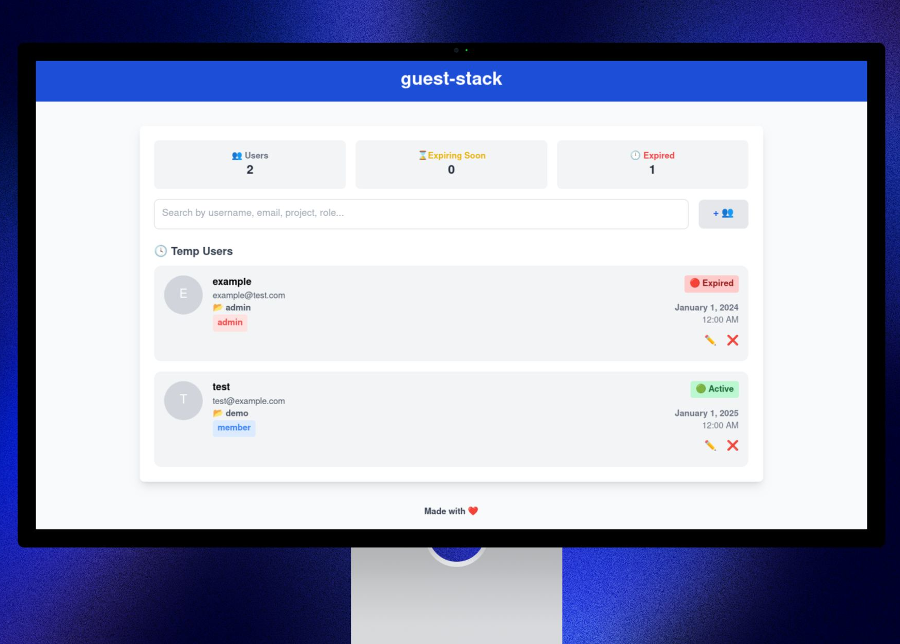

# Guest-stack
Guest-stack is an OpenStack plugin designed to facilitate the temporary management of user permissions. 

Its development was prompted by the recognition of a clear need within the OpenStack framework, which has been outlined [here](https://wiki.openstack.org/wiki/Keystone/TempUserProvisioning/Blueprint).

It enables the creation of temporary users with access to OpenStack, making the process simple and immediate.

## Preview


## Features
* **Temporary User Creation:** This feature allows for the straightforward creation of temporary users with access to OpenStack.

* **Automatic Removal:** Temporary users are automatically removed upon expiration, ensuring that no unauthorized access remains after their usage period.

* **Temporary Passwords:** Each temporary user gets a temporary password, which is logged for immediate access. This is for use in `development` environments.

## Setup
**1. Install DevStack:** If you haven't installed DevStack yet, follow the official instructions here: [Devstack installation guide](https://docs.openstack.org/devstack/latest/).

**2. Update local.conf**
``` bash
[[local|localrc]]
      ...
enable_plugin guest-stack https://github.com/carmine-ambrosino/guest-stack.git main
```


**3. Run stack.sh**
``` bash
./stack.sh
```

**4. Test guest-stack**
```
http://<openstack_host>:5234
```

## ⚠️ Note
* **View Temporary Passwords:** To view the temporary passwords of users, execute on the OpenStack host:
``` bash
journalctl -u guest-stack -f
``` 

* **Update autoremoval time scheduling:**  To change the automatic removal schedule for users, edit the `config.py` file. The current scheduler runs every minute.
``` python
# config.py
   ...
TIME_SCHED = 2
```


* **Development Mode:** This plugin is in development mode and should not be used in production environments.
